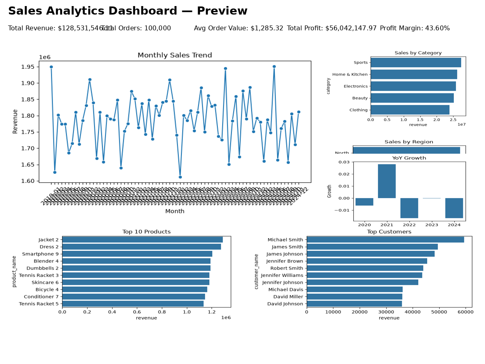

# Sales Analytics Dashboard

[](https://share.streamlit.io/Venkurella9/sales-analytics-dashboard/main/dashboard/app.py)

End-to-end Sales Analytics Dashboard built with Python, SQLite, and Streamlit for retail sales performance analysis.

## Live Demo
Access the interactive Streamlit dashboard here:

[Open Live Demo](https://share.streamlit.io/Venkurella9/sales-analytics-dashboard/main/dashboard/app.py)

## Project Overview
This project demonstrates a complete data analytics workflow for a retail sales environment. It includes synthetic dataset generation, data cleaning and persistence with SQLite, business-focused SQL queries, and an interactive Streamlit dashboard with KPI monitoring, visual analytics, and customer segmentation.

The dashboard is designed for portfolio presentation and hiring managers evaluating analytical skills, business insight generation, and production-ready dashboard development.

## Features
- Synthetic retail sales dataset generation with configurable row counts
- Data cleaning pipeline and SQLite database creation
- KPI cards for Revenue, Orders, Average Order Value, Profit, and Profit Margin
- Visual analytics: Monthly trends, category performance, regional sales, top products, and top customers
- Filter-driven exploration by Year, Month, Region, and Category
- Year-over-Year sales growth comparisons
- Customer RFM segmentation for champion and at-risk customer identification
- Business insights summaries for executive decision support

## Tech Stack
- Python 3.10+
- Pandas and NumPy for data processing
- SQLite for data storage and query performance
- Streamlit for interactive dashboard delivery
- Plotly, Matplotlib, and Seaborn for visualizations

## Dashboard Insights
The dashboard surfaces key business insights, including:
- Monthly revenue and profit trends to support seasonal planning
- Category and regional performance to prioritize inventory and campaigns
- Top-selling products and customer segments for retention and growth
- YoY growth trends to quantify progress and identify emerging patterns
- Profit margin analysis to highlight efficiency and pricing opportunities

## How to Run Locally
1. Clone the repository

```bash
git clone https://github.com/Venkurella9/sales-analytics-dashboard.git
cd sales-analytics-dashboard
```

2. Create and activate a virtual environment

```bash
python -m venv .venv
source .venv/bin/activate
```

3. Install requirements

```bash
pip install -r requirements.txt
```

4. Generate the dataset

```bash
python data/generate_data.py --rows 100000
```

5. Clean the data and create the SQLite database

```bash
python data/clean_data.py
```

6. Launch the Streamlit dashboard

```bash
.venv/bin/python -m streamlit run dashboard/app.py
```

## Project Layout
- `data/`: data generation and cleaning scripts, CSV files
- `sql/`: SQL schema and analysis queries
- `notebooks/`: example notebooks for cleaning and EDA
- `dashboard/`: Streamlit app and helper modules
- `images/`: screenshots and visuals
- `docs/`: methodology and insights

See `docs/` for methodology and analysis notes.

## Tech Stack
- Python 3.10+
- Pandas / NumPy for data processing
- SQLite for data storage and analysis
- Streamlit for interactive dashboard
- Plotly / Matplotlib / Seaborn for visualizations

## Features
- End-to-end synthetic retail sales data generation (100k+ rows)
- Data cleaning pipeline and SQLite persistence
- KPI cards: Total Revenue, Total Orders, Average Order Value, Total Profit, Profit Margin
- Charts: Monthly Trend, Sales by Category, Sales by Region, Top Products, Top Customers
- Filters: Year, Month, Region, Category
- Year-over-Year (YoY) Sales Growth
- Customer Segmentation (RFM)
- Business Insights panel with filter-aware summaries

## Dashboard Preview


## Business Insights
- Seasonal trends surface from the Monthly Sales Trend chart; use promo timing accordingly.
- High-revenue categories and top products indicate where to prioritize inventory and marketing.
- Regional profit discrepancies suggest opportunities for pricing or cost optimization.
- A small number of top customers drive disproportionate revenue — consider retention programs.

## Future Enhancements
- Add customer lifetime value (LTV) and churn prediction models using scikit-learn.
- Add geographic heatmap and store-level analysis.
- Add exportable reports and PDF snapshots from the dashboard.
- Add automated unit/integration tests and CI pipeline.
